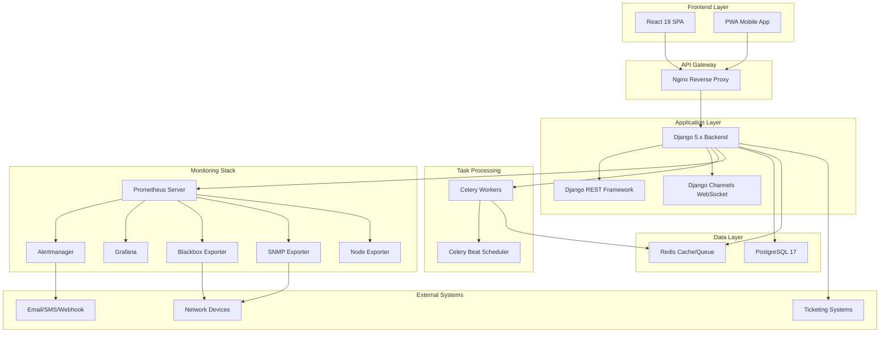
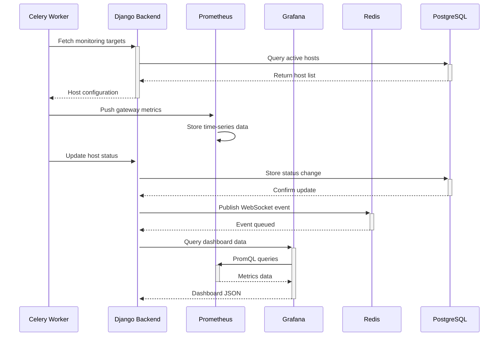

# Design Document

## Overview

The Network Monitoring Tool is a modern, enterprise-grade Network Management System (NMS) designed for ISP and network operations environments. The system employs a hybrid architecture that combines Django for business logic and workflow management, Prometheus for metrics collection and storage, and Grafana for advanced visualization and reporting.

The architecture follows microservices principles with containerized deployment, providing scalability, maintainability, and high availability. The system supports monitoring of 1000+ network devices including access points, subscriber modules, firewalls, switches, and other network infrastructure components.

## Architecture

### High-Level Architecture

The system follows a layered architecture pattern with clear separation of concerns:



### Technology Stack

**Backend Framework:**
- Django 5.1+ with Python 3.12+
- Django REST Framework for API endpoints
- Django Channels with Redis for WebSocket communication
- Celery with Redis for background task processing

**Frontend Framework:**
- React 19 with TypeScript
- Redux Toolkit for state management
- React Router for navigation
- Tailwind CSS + shadcn/ui components

**Monitoring Stack:**
- Prometheus 3.x for metrics collection and storage
- Grafana 11.x+ for visualization and dashboards
- Alertmanager for alert processing and routing
- Various exporters (blackbox, SNMP, node)

**Database and Caching:**
- PostgreSQL 17 for primary data storage
- Redis for caching and message queuing
- SQLite fallback for development environments

**Deployment and Infrastructure:**
- Docker and Docker Compose for containerization
- Nginx for reverse proxy and static file serving
- SSL/TLS termination and security headers

## Components and Interfaces

### Backend Components

#### Core Django Apps

**1. Core App (`core/`)**
- User management and authentication
- RBAC implementation
- Audit logging
- System configuration

**2. Monitoring App (`monitoring/`)**
- Device management (hosts, groups, locations)
- Monitoring configuration and thresholds
- Status tracking and history
- Auto-discovery functionality

**3. API App (`api/`)**
- REST API endpoints using Django REST Framework
- Authentication and permission classes
- Serializers for data transformation
- API versioning and documentation

**4. Frontend App (`frontend/`)**
- React build integration
- Static file management
- Template rendering for fallback views

#### Key Models

```python
# Device Management Models
class Location(models.Model):
    name = models.CharField(max_length=100)
    description = models.TextField(blank=True)
    latitude = models.DecimalField(max_digits=9, decimal_places=6, null=True)
    longitude = models.DecimalField(max_digits=9, decimal_places=6, null=True)

class DeviceGroup(models.Model):
    name = models.CharField(max_length=100)
    description = models.TextField(blank=True)
    parent = models.ForeignKey('self', null=True, blank=True)

class Host(models.Model):
    # ISP-specific fields
    ap_name = models.CharField(max_length=100, blank=True)
    cid = models.CharField(max_length=50, blank=True)
    ap_ip = models.GenericIPAddressField(null=True, blank=True)
    sm_ip = models.GenericIPAddressField(null=True, blank=True)
    
    # Standard fields
    device_name = models.CharField(max_length=100)
    hostname = models.CharField(max_length=255)
    ip_address = models.GenericIPAddressField()
    location = models.ForeignKey(Location, on_delete=models.CASCADE)
    group = models.ForeignKey(DeviceGroup, on_delete=models.CASCADE)
    
    # Monitoring configuration
    monitor_ping = models.BooleanField(default=True)
    monitor_snmp = models.BooleanField(default=False)
    snmp_community = models.CharField(max_length=100, blank=True)
    snmp_version = models.CharField(max_length=10, default='2c')
    
    # Status tracking
    status = models.CharField(max_length=20, default='UNKNOWN')
    last_check = models.DateTimeField(null=True, blank=True)
    acknowledged = models.BooleanField(default=False)
    ack_comment = models.TextField(blank=True)
    ack_user = models.ForeignKey(User, null=True, blank=True)
    ack_timestamp = models.DateTimeField(null=True, blank=True)

# Monitoring and Alerting Models
class MonitoringProfile(models.Model):
    name = models.CharField(max_length=100)
    ping_enabled = models.BooleanField(default=True)
    ping_warning_threshold = models.IntegerField(default=100)  # ms
    ping_critical_threshold = models.IntegerField(default=500)  # ms
    packet_loss_warning = models.IntegerField(default=5)  # %
    packet_loss_critical = models.IntegerField(default=20)  # %

class Alert(models.Model):
    host = models.ForeignKey(Host, on_delete=models.CASCADE)
    alert_type = models.CharField(max_length=50)
    severity = models.CharField(max_length=20)
    message = models.TextField()
    timestamp = models.DateTimeField(auto_now_add=True)
    acknowledged = models.BooleanField(default=False)
    resolved = models.BooleanField(default=False)

class MaintenanceWindow(models.Model):
    name = models.CharField(max_length=100)
    description = models.TextField(blank=True)
    start_time = models.DateTimeField()
    end_time = models.DateTimeField()
    hosts = models.ManyToManyField(Host)
    created_by = models.ForeignKey(User, on_delete=models.CASCADE)
```

#### Service Layer

**Monitoring Service (`services/monitoring.py`)**
```python
class MonitoringService:
    def check_host_ping(self, host):
        """Perform ping check and update host status"""
        
    def collect_snmp_metrics(self, host):
        """Collect SNMP metrics from device"""
        
    def update_host_status(self, host, status, metrics=None):
        """Update host status and trigger alerts if needed"""
        
    def process_threshold_violations(self, host, metrics):
        """Check thresholds and generate alerts"""

class DiscoveryService:
    def scan_subnet(self, subnet, discovery_profile):
        """Scan subnet for new devices"""
        
    def identify_device_type(self, ip_address):
        """Attempt to identify device type via SNMP"""
```

### Frontend Components

#### React Component Architecture

**1. Layout Components**
- `App.jsx` - Main application wrapper
- `Layout.jsx` - Main layout with sidebar and header
- `Sidebar.jsx` - Collapsible navigation sidebar
- `Header.jsx` - Top navigation bar with user menu

**2. Dashboard Components**
- `Dashboard.jsx` - Main dashboard container
- `SummaryCards.jsx` - Status summary widgets
- `LocationOverview.jsx` - Location health table
- `LiveActivityLog.jsx` - Real-time activity feed
- `TopologyMap.jsx` - Network topology visualization

**3. Host Management Components**
- `HostTable.jsx` - Advanced host listing with filters
- `HostForm.jsx` - Add/edit host form
- `BulkUpload.jsx` - Excel file upload component
- `HostDetails.jsx` - Detailed host view

**4. Monitoring Components**
- `AlertsList.jsx` - Alert management interface
- `MetricsChart.jsx` - Time-series chart component
- `ThresholdConfig.jsx` - Threshold configuration
- `MaintenanceWindows.jsx` - Maintenance scheduling

#### State Management with Redux Toolkit

```javascript
// Store structure
const store = {
  auth: {
    user: null,
    token: null,
    isAuthenticated: false
  },
  hosts: {
    items: [],
    loading: false,
    filters: {},
    pagination: {}
  },
  alerts: {
    items: [],
    unacknowledged: 0,
    filters: {}
  },
  dashboard: {
    summary: {},
    recentActivity: [],
    topologyData: {}
  },
  ui: {
    sidebarCollapsed: false,
    theme: 'light',
    notifications: []
  }
}

// API slice using RTK Query
const apiSlice = createApi({
  reducerPath: 'api',
  baseQuery: fetchBaseQuery({
    baseUrl: '/api/v1/',
    prepareHeaders: (headers, { getState }) => {
      const token = getState().auth.token
      if (token) {
        headers.set('authorization', `Bearer ${token}`)
      }
      return headers
    }
  }),
  tagTypes: ['Host', 'Alert', 'User'],
  endpoints: (builder) => ({
    getHosts: builder.query({
      query: (params) => ({
        url: 'hosts/',
        params
      }),
      providesTags: ['Host']
    }),
    updateHost: builder.mutation({
      query: ({ id, ...patch }) => ({
        url: `hosts/${id}/`,
        method: 'PATCH',
        body: patch
      }),
      invalidatesTags: ['Host']
    })
  })
})
```

### Monitoring Stack Integration

#### Prometheus Configuration

The system integrates with Prometheus for metrics collection using multiple exporters:

**Blackbox Exporter Configuration:**
```yaml
modules:
  icmp:
    prober: icmp
    timeout: 5s
    icmp:
      protocol: "icmp"
      preferred_ip_protocol: "ip4"
  
  http_2xx:
    prober: http
    timeout: 5s
    http:
      valid_http_versions: ["HTTP/1.1", "HTTP/2.0"]
      valid_status_codes: []
      method: GET
```

**SNMP Exporter Integration:**
- Custom SNMP configurations for different device types
- MIB-based metric collection
- Interface statistics and system metrics
- Environmental monitoring (temperature, fans, power)

#### Grafana Integration

**Dashboard Embedding:**
- Grafana dashboards embedded in React components using iframes
- Single sign-on integration between Django and Grafana
- Custom dashboard provisioning for different device types
- Automated dashboard generation based on device discovery

**Data Source Configuration:**
```yaml
apiVersion: 1
datasources:
  - name: Prometheus
    type: prometheus
    access: proxy
    url: http://prometheus:9090
    isDefault: true
  - name: PostgreSQL
    type: postgres
    url: postgres:5432
    database: nms_db
    user: nms_user
```

## Data Models

### Database Schema Design

The system uses PostgreSQL as the primary database with the following key design principles:

1. **Normalization**: Proper normalization to reduce data redundancy
2. **Indexing**: Strategic indexing for query performance
3. **Partitioning**: Time-based partitioning for metrics and logs
4. **Constraints**: Foreign key constraints and data validation

#### Core Tables

**Users and Authentication:**
```sql
-- Extended Django User model
CREATE TABLE auth_user (
    id SERIAL PRIMARY KEY,
    username VARCHAR(150) UNIQUE NOT NULL,
    email VARCHAR(254) NOT NULL,
    first_name VARCHAR(150),
    last_name VARCHAR(150),
    is_active BOOLEAN DEFAULT TRUE,
    is_staff BOOLEAN DEFAULT FALSE,
    is_superuser BOOLEAN DEFAULT FALSE,
    date_joined TIMESTAMP WITH TIME ZONE DEFAULT NOW()
);

-- Role-based access control
CREATE TABLE core_role (
    id SERIAL PRIMARY KEY,
    name VARCHAR(50) UNIQUE NOT NULL,
    description TEXT,
    permissions JSONB
);

CREATE TABLE core_userrole (
    id SERIAL PRIMARY KEY,
    user_id INTEGER REFERENCES auth_user(id),
    role_id INTEGER REFERENCES core_role(id),
    location_id INTEGER REFERENCES monitoring_location(id),
    group_id INTEGER REFERENCES monitoring_devicegroup(id)
);
```

**Device Management:**
```sql
-- Locations
CREATE TABLE monitoring_location (
    id SERIAL PRIMARY KEY,
    name VARCHAR(100) NOT NULL,
    description TEXT,
    latitude DECIMAL(9,6),
    longitude DECIMAL(9,6),
    created_at TIMESTAMP WITH TIME ZONE DEFAULT NOW(),
    updated_at TIMESTAMP WITH TIME ZONE DEFAULT NOW()
);

-- Device Groups (hierarchical)
CREATE TABLE monitoring_devicegroup (
    id SERIAL PRIMARY KEY,
    name VARCHAR(100) NOT NULL,
    description TEXT,
    parent_id INTEGER REFERENCES monitoring_devicegroup(id),
    created_at TIMESTAMP WITH TIME ZONE DEFAULT NOW()
);

-- Hosts/Devices
CREATE TABLE monitoring_host (
    id SERIAL PRIMARY KEY,
    -- ISP-specific fields
    ap_name VARCHAR(100),
    cid VARCHAR(50),
    ap_ip INET,
    sm_ip INET,
    -- Standard fields
    device_name VARCHAR(100) NOT NULL,
    hostname VARCHAR(255) NOT NULL,
    ip_address INET NOT NULL,
    location_id INTEGER REFERENCES monitoring_location(id),
    group_id INTEGER REFERENCES monitoring_devicegroup(id),
    -- Monitoring configuration
    monitor_ping BOOLEAN DEFAULT TRUE,
    monitor_snmp BOOLEAN DEFAULT FALSE,
    snmp_community VARCHAR(100),
    snmp_version VARCHAR(10) DEFAULT '2c',
    -- Status
    status VARCHAR(20) DEFAULT 'UNKNOWN',
    last_check TIMESTAMP WITH TIME ZONE,
    acknowledged BOOLEAN DEFAULT FALSE,
    ack_comment TEXT,
    ack_user_id INTEGER REFERENCES auth_user(id),
    ack_timestamp TIMESTAMP WITH TIME ZONE,
    -- Metadata
    created_at TIMESTAMP WITH TIME ZONE DEFAULT NOW(),
    updated_at TIMESTAMP WITH TIME ZONE DEFAULT NOW()
);

-- Indexes for performance
CREATE INDEX idx_host_ip_address ON monitoring_host(ip_address);
CREATE INDEX idx_host_status ON monitoring_host(status);
CREATE INDEX idx_host_location ON monitoring_host(location_id);
CREATE INDEX idx_host_group ON monitoring_host(group_id);
CREATE INDEX idx_host_last_check ON monitoring_host(last_check);
```

**Monitoring and Metrics:**
```sql
-- Time-series metrics (partitioned by time)
CREATE TABLE monitoring_metric (
    id BIGSERIAL,
    host_id INTEGER REFERENCES monitoring_host(id),
    metric_name VARCHAR(100) NOT NULL,
    metric_value DOUBLE PRECISION,
    labels JSONB,
    timestamp TIMESTAMP WITH TIME ZONE NOT NULL,
    PRIMARY KEY (id, timestamp)
) PARTITION BY RANGE (timestamp);

-- Create monthly partitions
CREATE TABLE monitoring_metric_2025_01 PARTITION OF monitoring_metric
    FOR VALUES FROM ('2025-01-01') TO ('2025-02-01');

-- Alerts
CREATE TABLE monitoring_alert (
    id SERIAL PRIMARY KEY,
    host_id INTEGER REFERENCES monitoring_host(id),
    alert_type VARCHAR(50) NOT NULL,
    severity VARCHAR(20) NOT NULL,
    message TEXT NOT NULL,
    labels JSONB,
    timestamp TIMESTAMP WITH TIME ZONE DEFAULT NOW(),
    acknowledged BOOLEAN DEFAULT FALSE,
    ack_user_id INTEGER REFERENCES auth_user(id),
    ack_timestamp TIMESTAMP WITH TIME ZONE,
    resolved BOOLEAN DEFAULT FALSE,
    resolved_timestamp TIMESTAMP WITH TIME ZONE
);

CREATE INDEX idx_alert_host ON monitoring_alert(host_id);
CREATE INDEX idx_alert_timestamp ON monitoring_alert(timestamp);
CREATE INDEX idx_alert_severity ON monitoring_alert(severity);
CREATE INDEX idx_alert_acknowledged ON monitoring_alert(acknowledged);
```

### Data Flow Architecture



## Correctness Properties

*A property is a characteristic or behavior that should hold true across all valid executions of a system—essentially, a formal statement about what the system should do. Properties serve as the bridge between human-readable specifications and machine-verifiable correctness guarantees.*

Based on the prework analysis, I've identified properties that can be tested across the system. After reviewing for redundancy, I've consolidated related properties and eliminated duplicates to ensure each property provides unique validation value.

### Authentication and Authorization Properties

Property 1: Credential validation consistency
*For any* set of login credentials, the authentication system should accept them if and only if they match valid user credentials in the system
**Validates: Requirements 1.1**

Property 2: JWT token issuance
*For any* successful authentication, the system should issue a valid JWT token and establish session state
**Validates: Requirements 1.2**

Property 3: MFA enforcement
*For any* user with MFA enabled, authentication should require additional verification factors beyond username/password
**Validates: Requirements 1.3**

Property 4: Role-based permission enforcement
*For any* user action, the system should allow the action if and only if the user's role has the required permissions
**Validates: Requirements 1.5, 1.6, 1.7, 1.8**

Property 5: Location and group access control
*For any* data access request, users should only see data for locations and groups they are assigned to
**Validates: Requirements 1.9**

Property 6: Comprehensive audit logging
*For any* user action in the system, an audit log entry should be created with timestamp, user identity, and action details
**Validates: Requirements 1.10**

### Data Management Properties

Property 7: Excel column auto-detection
*For any* valid Excel file upload, the system should correctly identify and map columns for all ISP-specific fields (AP Name, CID, AP IP, SM IP, Device Name, Location, Hostname, Group)
**Validates: Requirements 2.1**

Property 8: Data validation during bulk operations
*For any* bulk upload containing invalid data, the system should reject the invalid entries and report specific errors
**Validates: Requirements 2.2, 2.9**

Property 9: Permission-based bulk operations
*For any* bulk delete operation, the system should allow it if and only if the user has Admin or SuperAdmin privileges
**Validates: Requirements 2.3**

Property 10: CRUD operation consistency
*For any* valid device data, the system should support add, edit, and delete operations while maintaining data integrity
**Validates: Requirements 2.4, 2.10**

Property 11: Multi-format export capability
*For any* export request, the system should generate valid files in Excel, CSV, JSON, and PDF formats containing all requested data types
**Validates: Requirements 2.5, 2.6**

Property 12: Backup and restore round-trip
*For any* database state, performing backup then restore should produce an equivalent database state
**Validates: Requirements 2.7**

Property 13: Migration data preservation
*For any* SQLite monitoring.db file, migration to PostgreSQL should preserve all data with equivalent structure and relationships
**Validates: Requirements 2.8**

### Monitoring and Metrics Properties

Property 14: Ping monitoring completeness
*For any* host with ping monitoring enabled, the system should measure latency, packet loss, and status against configured thresholds
**Validates: Requirements 3.1**

Property 15: SNMP protocol support
*For any* device supporting SNMP v2c or v3, the system should successfully collect interface statistics, system metrics, and environmental data
**Validates: Requirements 3.2, 3.3, 3.4, 3.6**

Property 16: Conditional metrics collection
*For any* device with optical interfaces, the system should collect TX/RX power levels and optical diagnostics when available
**Validates: Requirements 3.5**

Property 17: Service check protocol support
*For any* configured service check, the system should correctly test TCP/UDP ports and HTTP/HTTPS endpoints
**Validates: Requirements 3.7**

Property 18: Plugin execution safety
*For any* valid Python monitoring plugin, the system should execute it safely and collect the returned metrics
**Validates: Requirements 3.8**

Property 19: Discovery workflow integrity
*For any* auto-discovery scan, discovered devices should require explicit approval before being added to monitoring
**Validates: Requirements 3.9, 3.10**

Property 20: Threshold configuration flexibility
*For any* host or group, the system should support configurable warning and critical thresholds for all monitored metrics
**Validates: Requirements 3.11**

Property 21: Anomaly detection accuracy
*For any* monitored metric with established baseline, the system should detect significant deviations using machine learning algorithms
**Validates: Requirements 3.12**

Property 22: Prometheus integration consistency
*For any* metric pushed to Prometheus, the data should be consistent with the source measurements and properly formatted
**Validates: Requirements 3.13**

### Dashboard and Visualization Properties

Property 23: Dashboard widget functionality
*For any* dashboard widget, users should be able to add, remove, move, and configure it through drag-and-drop operations
**Validates: Requirements 4.2**

Property 24: Summary card accuracy
*For any* point in time, dashboard summary cards should display correct counts for UP, DOWN, WARNING, MAINTENANCE, and TOTAL devices
**Validates: Requirements 4.3**

Property 25: Dashboard panel content consistency
*For any* dashboard view, the Location Overview and Live Activity Log panels should display current, accurate data
**Validates: Requirements 4.4**

Property 26: Host table functionality
*For any* host table operation (filter, sort, search, paginate), the results should be accurate and state should persist across page refreshes
**Validates: Requirements 4.5, 4.6**

Property 27: Grafana chart embedding
*For any* historical data request, embedded Grafana charts should display accurate time-series data for latency, loss, uptime, and traffic
**Validates: Requirements 4.7**

Property 28: Topology visualization accuracy
*For any* network topology, the Cytoscape.js rendering should accurately represent device status through colors and show correct connection links
**Validates: Requirements 4.8**

Property 29: Report generation completeness
*For any* report request, the system should generate accurate status charts, trends, traffic analysis, and SLA metrics
**Validates: Requirements 4.9, 4.10**

Property 30: PDF export functionality
*For any* dashboard or report view, PDF export should generate a properly formatted document containing all visible data
**Validates: Requirements 4.11**

Property 31: PWA offline capability
*For any* mobile device, the PWA should function offline for basic operations and deliver push notifications when connectivity is restored
**Validates: Requirements 4.12**

### Alert and Notification Properties

Property 32: Real-time alert generation
*For any* threshold violation or status change, the system should generate alerts immediately without delay
**Validates: Requirements 5.1**

Property 33: Multi-channel notification delivery
*For any* alert, notifications should be sent via all configured channels (Email, Telegram, Slack, Teams, SMS) according to user preferences
**Validates: Requirements 5.2, 5.8**

Property 34: Alert escalation timing
*For any* unacknowledged alert, escalation should occur after the configured time interval to higher-level contacts
**Validates: Requirements 5.3**

Property 35: Template variable substitution
*For any* alert template with variables, the system should correctly substitute all variables with actual values
**Validates: Requirements 5.4**

Property 36: Maintenance window alert suppression
*For any* device in an active maintenance window, alerts should be suppressed and automatically restored when the window expires
**Validates: Requirements 5.5, 6.5, 6.7**

Property 37: Alert correlation and deduplication
*For any* set of related alerts, the system should correlate them for root-cause analysis and deduplicate to prevent notification flooding
**Validates: Requirements 5.6, 5.9**

Property 38: Alert history tracking
*For any* alert, the system should maintain complete history including timestamps, acknowledgment status, resolution details, and escalation chains
**Validates: Requirements 5.7, 5.10**

### Acknowledgment and Workflow Properties

Property 39: Mandatory acknowledgment comments
*For any* device in DOWN or WARNING state, acknowledgment should require a non-empty comment from the user
**Validates: Requirements 6.1**

Property 40: Acknowledgment UI prompts
*For any* unacknowledged device in DOWN state, the UI should display the prompt "Please ACK and comment why hostname is down"
**Validates: Requirements 6.2**

Property 41: Acknowledgment visual feedback
*For any* acknowledged device, the system should update icons and status symbols to reflect the acknowledgment state
**Validates: Requirements 6.3**

Property 42: Maintenance window management
*For any* maintenance window, the system should support scheduling with start/end times, affected devices, and calendar views
**Validates: Requirements 6.4, 6.9**

Property 43: Acknowledgment history tracking
*For any* acknowledgment action, the system should record user identity, timestamp, and comments in the workflow history
**Validates: Requirements 6.6**

Property 44: Bulk acknowledgment operations
*For any* set of selected devices, users with appropriate permissions should be able to acknowledge them all with a single operation
**Validates: Requirements 6.8, 6.10**

### Logging and Audit Properties

Property 45: Comprehensive event logging
*For any* system event (status change, user action, system event), a permanent log entry should be created with complete details
**Validates: Requirements 7.1**

Property 46: Log retention and archiving
*For any* log entry, the system should apply configured retention policies and automatically archive or purge data as specified
**Validates: Requirements 7.2, 7.10**

Property 47: Log view filtering and search
*For any* log query (all logs, per-host, alert history), the system should provide accurate filtering, searching, and sorting capabilities
**Validates: Requirements 7.3, 7.7**

Property 48: Audit trail completeness
*For any* user action, the audit system should maintain complete trails showing who performed what actions and when
**Validates: Requirements 7.4**

Property 49: Compliance report generation
*For any* compliance report request, the system should generate reports supporting GDPR and ISO-like requirements with all necessary data
**Validates: Requirements 7.5**

Property 50: Audit log export capability
*For any* audit log export request, the system should generate files in multiple formats suitable for external analysis
**Validates: Requirements 7.6**

Property 51: Configuration change tracking
*For any* configuration change, the audit system should log before/after values with complete change details
**Validates: Requirements 7.8**

Property 52: Log integrity protection
*For any* log entry, once created, it should be protected from modification or tampering
**Validates: Requirements 7.9**

<function_calls>
<invoke name="prework">
<parameter name="featureName">network-monitoring-tool

## Error Handling

### Error Classification and Response Strategy

The system implements a comprehensive error handling strategy with proper classification, logging, and user feedback:

#### 1. Authentication and Authorization Errors
- **Invalid Credentials**: Return 401 with clear message, log attempt
- **Insufficient Permissions**: Return 403 with specific permission required
- **Token Expiration**: Return 401 with refresh token guidance
- **MFA Failures**: Return 401 with MFA-specific error codes

#### 2. Data Validation Errors
- **Invalid Input Data**: Return 400 with field-specific validation messages
- **Constraint Violations**: Return 409 with conflict details
- **File Upload Errors**: Return 422 with file format/size issues
- **Bulk Operation Failures**: Return partial success with detailed error report

#### 3. Monitoring and Collection Errors
- **Network Timeouts**: Retry with exponential backoff, mark device as unreachable
- **SNMP Failures**: Log specific SNMP error codes, fallback to ping-only monitoring
- **Plugin Execution Errors**: Sandbox plugin failures, log stack traces safely
- **Threshold Configuration Errors**: Validate thresholds, provide sensible defaults

#### 4. System and Infrastructure Errors
- **Database Connection Failures**: Implement connection pooling with retry logic
- **Redis Unavailability**: Graceful degradation for caching and queuing
- **Prometheus/Grafana Errors**: Fallback to local metrics storage
- **External Service Failures**: Circuit breaker pattern for notifications

#### 5. Error Response Format

```json
{
  "error": {
    "code": "VALIDATION_ERROR",
    "message": "Invalid input data provided",
    "details": {
      "field_errors": {
        "ip_address": ["Invalid IP address format"],
        "hostname": ["Hostname already exists"]
      }
    },
    "timestamp": "2025-12-28T10:30:00Z",
    "request_id": "req_123456789"
  }
}
```

#### 6. Error Recovery Mechanisms

**Automatic Recovery:**
- Database connection retry with exponential backoff
- Failed monitoring tasks rescheduled with increasing intervals
- Network partition recovery with state synchronization
- Graceful service degradation during partial outages

**Manual Recovery:**
- Admin interface for clearing stuck tasks
- Database repair and consistency check tools
- Manual device status override capabilities
- Bulk data correction and cleanup utilities

## Testing Strategy

### Dual Testing Approach

The Network Monitoring Tool employs a comprehensive testing strategy combining unit tests for specific scenarios and property-based tests for universal correctness validation.

#### Unit Testing Strategy

**Framework**: pytest with Django test extensions
**Coverage Target**: 90%+ code coverage
**Focus Areas**:
- Specific examples demonstrating correct behavior
- Edge cases and boundary conditions
- Error handling and exception scenarios
- Integration points between components
- API endpoint functionality
- Database model validation

**Unit Test Categories**:

1. **Model Tests**: Validate data models, constraints, and relationships
2. **View Tests**: Test API endpoints, authentication, and response formats
3. **Service Tests**: Test business logic in service layer
4. **Integration Tests**: Test component interactions and external service integration
5. **Frontend Tests**: Jest/React Testing Library for component behavior

**Example Unit Test Structure**:
```python
class TestHostModel(TestCase):
    def test_host_creation_with_valid_data(self):
        """Test creating a host with all required fields"""
        
    def test_host_ip_address_validation(self):
        """Test IP address format validation"""
        
    def test_host_status_update_triggers_alert(self):
        """Test that status changes trigger appropriate alerts"""
        
    def test_acknowledgment_requires_comment(self):
        """Test that acknowledgments must include comments"""
```

#### Property-Based Testing Strategy

**Framework**: Hypothesis for Python, fast-check for JavaScript
**Configuration**: Minimum 100 iterations per property test
**Tag Format**: **Feature: network-monitoring-tool, Property {number}: {property_text}**

**Property Test Implementation**:

Each correctness property from the design document must be implemented as a property-based test. The tests will use intelligent generators to create realistic test data within the valid input space.

**Example Property Test**:
```python
from hypothesis import given, strategies as st
import pytest

class TestAuthenticationProperties:
    @given(st.text(), st.text())
    def test_credential_validation_consistency(self, username, password):
        """
        Feature: network-monitoring-tool, Property 1: 
        For any set of login credentials, the authentication system 
        should accept them if and only if they match valid user 
        credentials in the system
        """
        # Test implementation here
        
    @given(valid_user_strategy())
    def test_jwt_token_issuance(self, user_credentials):
        """
        Feature: network-monitoring-tool, Property 2:
        For any successful authentication, the system should issue 
        a valid JWT token and establish session state
        """
        # Test implementation here
```

**Smart Test Data Generators**:
```python
# Custom strategies for realistic test data
@st.composite
def host_strategy(draw):
    return {
        'hostname': draw(st.text(min_size=1, max_size=255)),
        'ip_address': draw(ip_address_strategy()),
        'device_name': draw(st.text(min_size=1, max_size=100)),
        'ap_name': draw(st.text(min_size=0, max_size=100)),
        'cid': draw(st.text(min_size=0, max_size=50))
    }

@st.composite
def ip_address_strategy(draw):
    return f"{draw(st.integers(1, 255))}.{draw(st.integers(0, 255))}.{draw(st.integers(0, 255))}.{draw(st.integers(1, 254))}"
```

#### Testing Infrastructure

**Continuous Integration**:
- GitHub Actions for automated testing
- Test matrix across Python 3.12+ and Node.js 20+
- Database testing against PostgreSQL and SQLite
- Browser testing with Playwright for E2E scenarios

**Test Environment Management**:
- Docker Compose for test environment setup
- Test database isolation and cleanup
- Mock external services (SNMP devices, notification services)
- Test data factories for consistent test setup

**Performance Testing**:
- Load testing with locust for API endpoints
- Database performance testing with realistic data volumes
- Memory and CPU profiling for monitoring tasks
- Network simulation for monitoring reliability testing

#### Test Organization and Execution

**Directory Structure**:
```
tests/
├── unit/
│   ├── test_models.py
│   ├── test_views.py
│   ├── test_services.py
│   └── test_utils.py
├── property/
│   ├── test_auth_properties.py
│   ├── test_monitoring_properties.py
│   └── test_data_properties.py
├── integration/
│   ├── test_api_integration.py
│   ├── test_monitoring_integration.py
│   └── test_notification_integration.py
├── frontend/
│   ├── components/
│   └── integration/
└── fixtures/
    ├── sample_data.json
    └── test_configs/
```

**Test Execution Commands**:
```bash
# Run all tests
pytest

# Run only unit tests
pytest tests/unit/

# Run property-based tests with verbose output
pytest tests/property/ -v --hypothesis-show-statistics

# Run with coverage
pytest --cov=nms --cov-report=html

# Run frontend tests
npm test

# Run E2E tests
playwright test
```

#### Quality Assurance Metrics

**Code Quality**:
- Code coverage minimum 90%
- Property test success rate 100% across 100+ iterations
- Static analysis with pylint, mypy, and ESLint
- Security scanning with bandit and npm audit

**Performance Benchmarks**:
- API response time < 200ms for 95th percentile
- Dashboard load time < 2 seconds
- Monitoring cycle completion < 30 seconds for 1000 devices
- Database query performance within acceptable thresholds

**Reliability Metrics**:
- Zero critical bugs in production
- Property test failure investigation and resolution
- Monitoring accuracy validation against known network states
- Alert delivery reliability testing

This comprehensive testing strategy ensures that the Network Monitoring Tool meets all correctness properties while maintaining high performance and reliability standards for enterprise network operations.